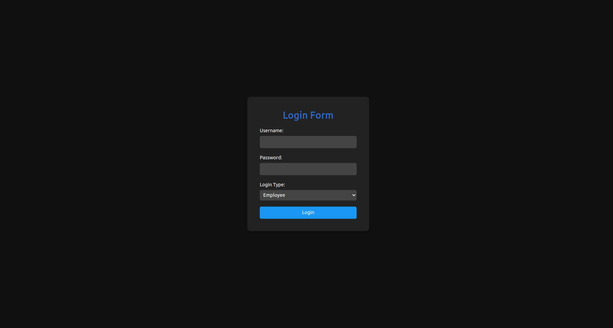
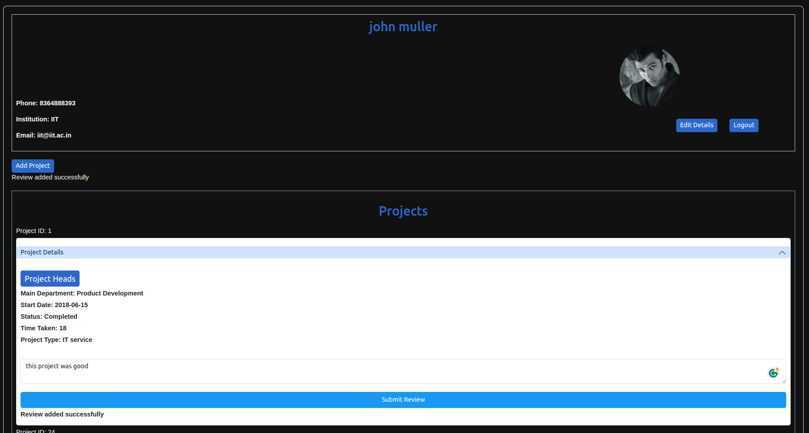

## Database Management System

### This is a Python Flask application that serves as a simple database management system for an Employee Management System (EMS). It allows users to log in as either an employee, client, or HR personnel and perform various operations.

## Requirements :
- Python 3.x
- Flask
- psycopg2
- sqlalchemy
- textblob

## setup 
- pip install Flask psycopg2 sqlalchemy textblob
- make changes in connection_db = psycopg2.connect("postgresql://<username>:<password>@<host>:<port>/<database>")
-  python3 server.py
- open new terminal 
- npm intall axios
- npm start

## Screenshots

